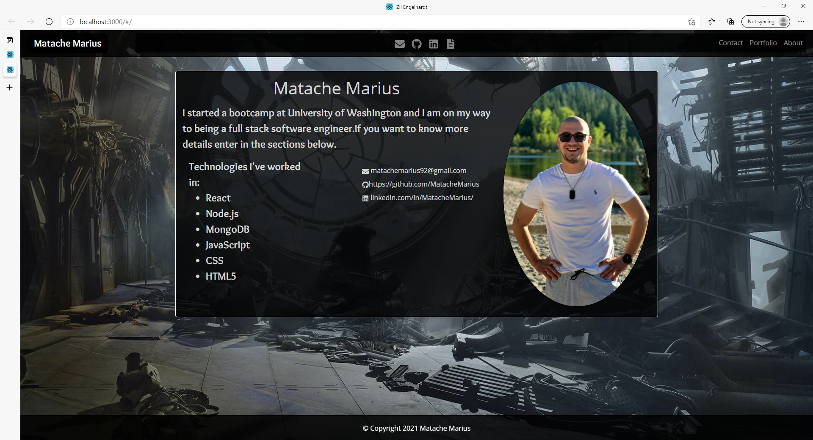
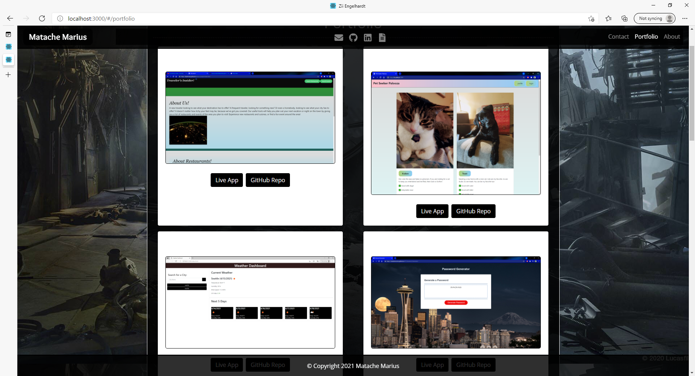
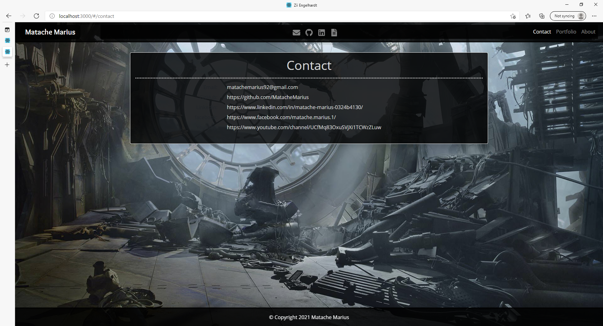

# React Portfolio

This is a portfolio website constructed by me for potential employers or clients to peruse my work and get into contact with me. It was built using the amazing frontend framework known as React.js.

### Picture1:

### Picture2:

### Picture3:

---
### Run
**1.Run in the command line** - `npm install`
**2.Run the this command to start your server** - `npm start`

### Credits:
* [npm](https://www.npmjs.com/)
* [Bootstrap](https://getbootstrap.com/)
* [Google](https://www.google.com/)
* [W3Schools](https://www.w3schools.com/)

### Contributors:

* matachemarius92@gmail.com
* [Matache Marius](https://github.com/MatacheMarius)
### Directory:
* [Current Repository](https://github.com/MatacheMarius/React-Portfolio)
* [Website](https://matachemarius.github.io/React-Portfolio/)
.
